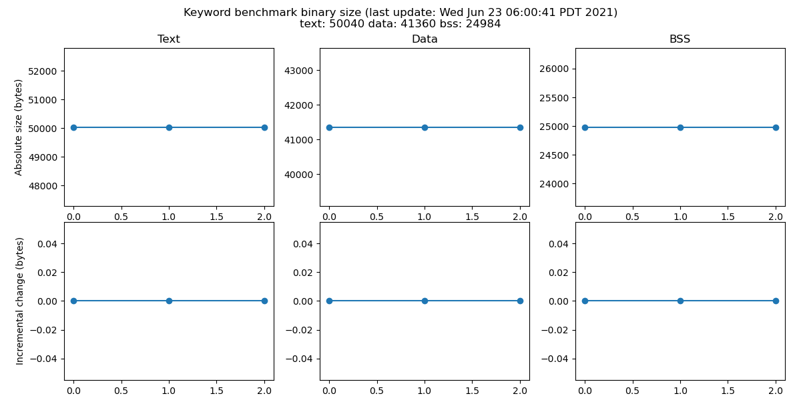
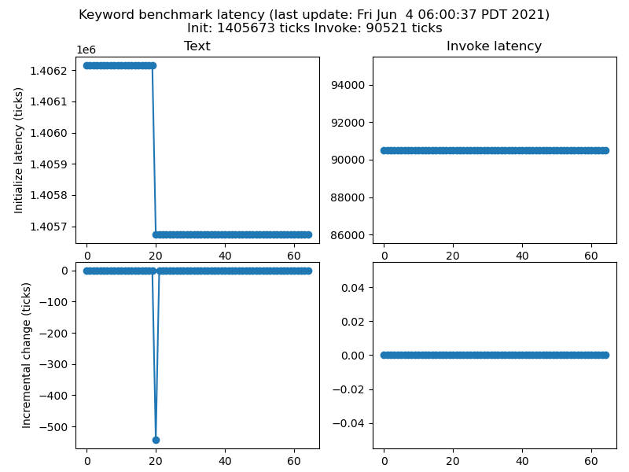
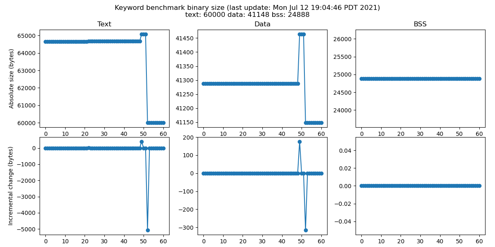
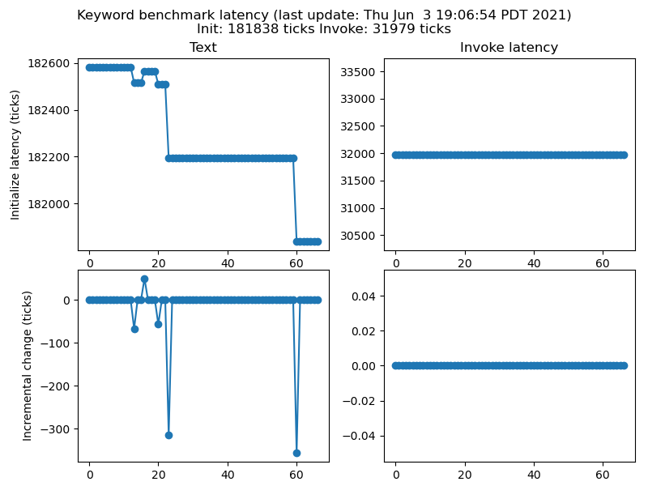
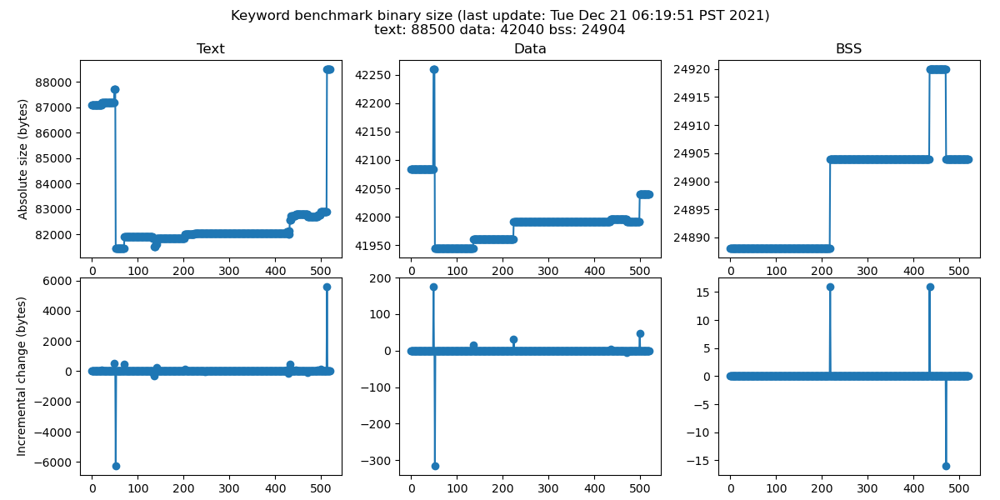
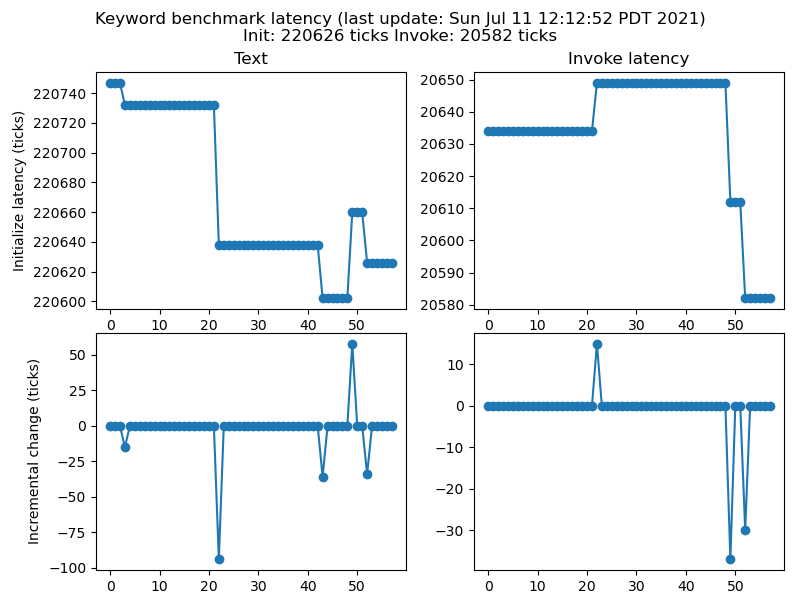
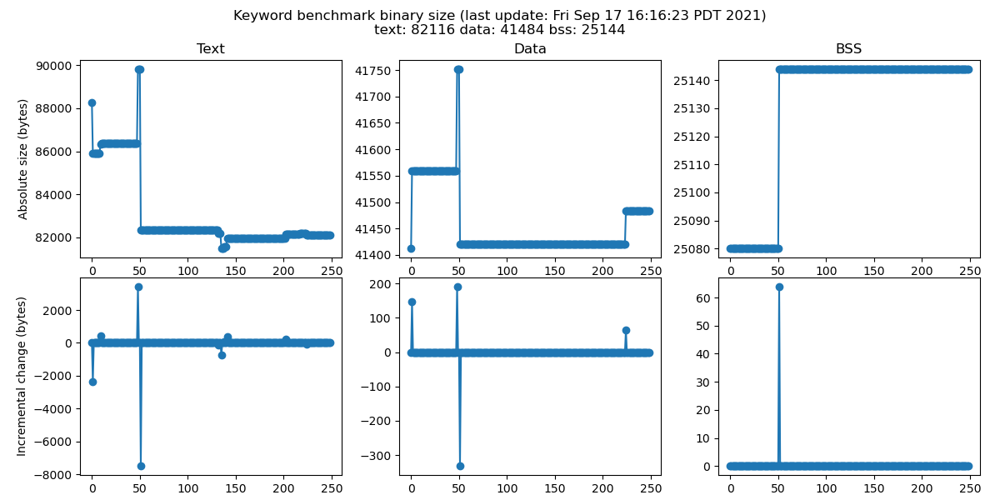
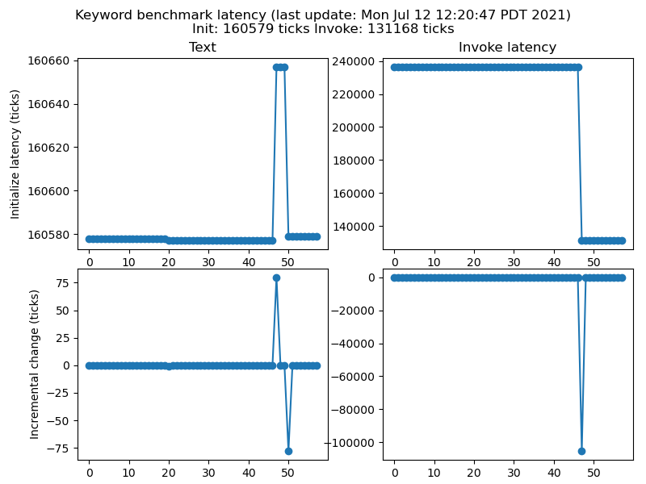

<!-- mdformat off(b/169948621#comment2) -->

<!--
Semi-automated TOC generation with instructions from
https://github.com/ekalinin/github-markdown-toc#auto-insert-and-update-toc

gh-md-toc --insert --no-backup xtensa.md
-->

<!--ts-->
   * [Summary](#summary)
   * [Detailed Results](#detailed-results)
      * [Hifimini](#hifimini)
         * [Unit tests](#unit-tests)
         * [Keyword Benchmark](#keyword-benchmark)
            * [Binary size graph](#binary-size-graph)
      * [Fusion F1](#fusion-f1)
         * [Unit tests](#unit-tests-1)
         * [Keyword Benchmark](#keyword-benchmark-1)
            * [Binary size graph](#binary-size-graph-1)
      * [Hifi5](#hifi5)
         * [Unit tests](#unit-tests-2)
         * [Keyword Benchmark](#keyword-benchmark-2)
            * [Binary size graph](#binary-size-graph-2)
      * [Vision P6](#vision-p6)
         * [Unit tests](#unit-tests-3)
         * [Keyword Benchmark](#keyword-benchmark-3)
            * [Binary size graph](#binary-size-graph-3)

<!-- Added by: advaitjain, at: Wed 21 Apr 2021 10:05:57 PM PDT -->

<!--te-->

# Summary

* Overall status (as seen on the tensorflow repo): 

* Table with more granular results

| Architecture |  Keyword (build) | Keyword (metrics) | Unit tests |
| ---------- |       -------      |     ------        |  --------  |
| Hifimini  |  |  |  |
| Fusion F1  |  |  |  |
| Hifi5  |  |  |  |
| Vision P6  |  |  |  |

# Detailed Results

## Hifimini

### Unit tests
* [Unit test build log](hifimini_unittest_log) from the most recent run.
* [Unittest status history](hifimini_unittest_status)

### Keyword Benchmark

* [Keyword benchmark build log](hifimini_build_log) from the most recent run.
* [Keyword benchmark build status history](hifimini_build_status)
* [Keyword Benchmark size history](hifimini_size_log)

#### Binary size graph

<!--
#### Latency graph

-->

## Fusion F1

### Unit tests

* [Unit test build log](fusion_f1_unittest_log) from the most recent run.
* [Unittest status history](fusion_f1_unittest_status)

### Keyword Benchmark

* [Keyword benchmark build log](fusion_f1_build_log) from the most recent run.
* [Keyword benchmark build status history](fusion_f1_build_status)
* [Keyword Benchmark size history](fusion_f1_size_log)

#### Binary size graph

<!--
#### Latency graph

-->

## Hifi5

### Unit tests

* [Unit test build log](hifi5_unittest_log) from the most recent run.
* [Unittest status history](hifi5_unittest_status)

### Keyword Benchmark

* [Keyword benchmark build log](hifi5_build_log) from the most recent run.
* [Keyword benchmark build status history](hifi5_build_status)
* [Keyword Benchmark size history](hifi5_size_log)

#### Binary size graph

<!--
#### Latency graph

-->

## Vision P6

### Unit tests

* [Unit test build log](vision_p6_unittest_log) from the most recent run.
* [Unittest status history](vision_p6_unittest_status)

### Keyword Benchmark

* [Keyword benchmark build log](vision_p6_build_log) from the most recent run.
* [Keyword benchmark build status history](vision_p6_build_status)
* [Keyword Benchmark size history](vision_p6_size_log)

#### Binary size graph

<!--
#### Latency graph

-->
